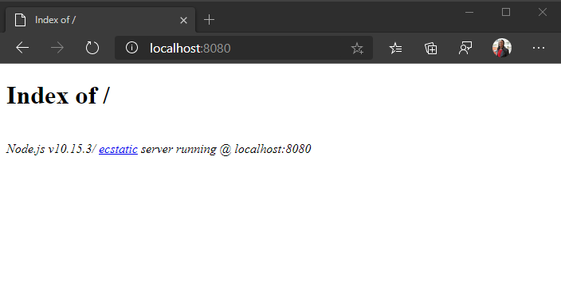

<!-- markdownlint-disable MD002 MD041 -->

<span data-ttu-id="658d4-101">Comece criando um diretório vazio para o projeto.</span><span class="sxs-lookup"><span data-stu-id="658d4-101">Start by creating an empty directory for the project.</span></span> <span data-ttu-id="658d4-102">Isso pode ser em um servidor HTTP ou em um diretório em sua máquina de desenvolvimento.</span><span class="sxs-lookup"><span data-stu-id="658d4-102">This can be on an HTTP server, or a directory on your development machine.</span></span> <span data-ttu-id="658d4-103">Se ele estiver em sua máquina de desenvolvimento, você precisará copiá-lo para um servidor para teste ou executar um servidor HTTP em sua máquina de desenvolvimento.</span><span class="sxs-lookup"><span data-stu-id="658d4-103">If it is on your development machine, you'll need to copy it to a server for testing, or run an HTTP server on your development machine.</span></span> <span data-ttu-id="658d4-104">Se você não tiver um desses, a próxima seção fornecerá instruções.</span><span class="sxs-lookup"><span data-stu-id="658d4-104">If you don't have either of those, the next section provides instructions.</span></span>

## <a name="start-a-local-web-server-optional"></a><span data-ttu-id="658d4-105">Iniciar um servidor Web local (opcional)</span><span class="sxs-lookup"><span data-stu-id="658d4-105">Start a local web server (optional)</span></span>

> [!NOTE]
> <span data-ttu-id="658d4-106">As etapas desta seção exigem [Node.js](https://nodejs.org).</span><span class="sxs-lookup"><span data-stu-id="658d4-106">The steps in this section require [Node.js](https://nodejs.org).</span></span>

<span data-ttu-id="658d4-107">Nesta seção, você usará [http-Server](https://www.npmjs.com/package/http-server) para executar um servidor http simples a partir da linha de comando.</span><span class="sxs-lookup"><span data-stu-id="658d4-107">In this section you will use [http-server](https://www.npmjs.com/package/http-server) to run a simple HTTP server from the command line.</span></span>

1. <span data-ttu-id="658d4-108">Abra a interface de linha de comando (CLI) no diretório que você criou para o projeto.</span><span class="sxs-lookup"><span data-stu-id="658d4-108">Open your command-line interface (CLI) in the directory you created for the project.</span></span>
1. <span data-ttu-id="658d4-109">Execute o seguinte comando para iniciar um servidor Web nesse diretório.</span><span class="sxs-lookup"><span data-stu-id="658d4-109">Run the following command to start a web server in that directory.</span></span>

    ```Shell
    npx http-server -c-1
    ```

1. <span data-ttu-id="658d4-110">Abra o navegador e navegue até `http://localhost:8080` .</span><span class="sxs-lookup"><span data-stu-id="658d4-110">Open your browser and browse to `http://localhost:8080`.</span></span>

<span data-ttu-id="658d4-111">Você verá um **índice de/** página.</span><span class="sxs-lookup"><span data-stu-id="658d4-111">You should see an **Index of /** page.</span></span> <span data-ttu-id="658d4-112">Isso confirma que o servidor HTTP está em execução.</span><span class="sxs-lookup"><span data-stu-id="658d4-112">This confirms that the HTTP server is running.</span></span>



## <a name="design-the-app"></a><span data-ttu-id="658d4-114">Projetar o aplicativo</span><span class="sxs-lookup"><span data-stu-id="658d4-114">Design the app</span></span>

<span data-ttu-id="658d4-115">Nesta seção, você criará o layout básico de interface do usuário para o aplicativo.</span><span class="sxs-lookup"><span data-stu-id="658d4-115">In this section you'll create the basic UI layout for the application.</span></span>

1. <span data-ttu-id="658d4-116">Crie um novo arquivo na raiz do projeto chamado **index.html** e adicione o código a seguir.</span><span class="sxs-lookup"><span data-stu-id="658d4-116">Create a new file in the root of the project named **index.html** and add the following code.</span></span>

    :::code language="html" source="../demo/graph-tutorial/index.html" id="indexSnippet":::

    <span data-ttu-id="658d4-117">Isso define o layout básico do aplicativo, incluindo uma barra de navegação.</span><span class="sxs-lookup"><span data-stu-id="658d4-117">This defines the basic layout of the app, including a navigation bar.</span></span> <span data-ttu-id="658d4-118">Ele também adiciona o seguinte:</span><span class="sxs-lookup"><span data-stu-id="658d4-118">It also adds the following:</span></span>

    - <span data-ttu-id="658d4-119">[Bootstrap](https://getbootstrap.com/) e seu JavaScript de suporte</span><span class="sxs-lookup"><span data-stu-id="658d4-119">[Bootstrap](https://getbootstrap.com/) and its supporting JavaScript</span></span>
    - [<span data-ttu-id="658d4-120">FontAwesome</span><span class="sxs-lookup"><span data-stu-id="658d4-120">FontAwesome</span></span>](https://fontawesome.com/)
    - [<span data-ttu-id="658d4-121">Moment.js</span><span class="sxs-lookup"><span data-stu-id="658d4-121">Moment.js</span></span>](https://momentjs.com/)
    - [<span data-ttu-id="658d4-122">Biblioteca de autenticação da Microsoft para JavaScript (MSAL.js) 2,0</span><span class="sxs-lookup"><span data-stu-id="658d4-122">Microsoft Authentication Library for JavaScript (MSAL.js) 2.0</span></span>](https://github.com/AzureAD/microsoft-authentication-library-for-js/tree/dev/lib/msal-browser)
    - [<span data-ttu-id="658d4-123">Biblioteca de cliente JavaScript do Microsoft Graph</span><span class="sxs-lookup"><span data-stu-id="658d4-123">Microsoft Graph JavaScript Client Library</span></span>](https://github.com/microsoftgraph/msgraph-sdk-javascript)

    > [!TIP]
    > <span data-ttu-id="658d4-124">A página inclui um favicon ( `<link rel="shortcut icon" href="g-raph.png">` ).</span><span class="sxs-lookup"><span data-stu-id="658d4-124">The page includes a favicon, (`<link rel="shortcut icon" href="g-raph.png">`).</span></span> <span data-ttu-id="658d4-125">Você pode remover essa linha ou pode baixar o arquivo de **g-raph.png** do [GitHub](https://github.com/microsoftgraph/g-raph).</span><span class="sxs-lookup"><span data-stu-id="658d4-125">You can remove this line, or you can download the **g-raph.png** file from [GitHub](https://github.com/microsoftgraph/g-raph).</span></span>

1. <span data-ttu-id="658d4-126">Crie um novo arquivo chamado **Style. css** e adicione o código a seguir.</span><span class="sxs-lookup"><span data-stu-id="658d4-126">Create a new file named **style.css** and add the following code.</span></span>

    :::code language="css" source="../demo/graph-tutorial/style.css":::

1. <span data-ttu-id="658d4-127">Crie um novo arquivo chamado **auth.js** e adicione o código a seguir.</span><span class="sxs-lookup"><span data-stu-id="658d4-127">Create a new file named **auth.js** and add the following code.</span></span>

    ```javascript
    function signIn() {
      // TEMPORARY
      updatePage({name: 'Megan Bowen', userName: 'meganb@contoso.com'});
    }

    function signOut() {
      // TEMPORARY
      updatePage();
    }
    ```

1. <span data-ttu-id="658d4-128">Crie um novo arquivo chamado **ui.js** e adicione o código a seguir.</span><span class="sxs-lookup"><span data-stu-id="658d4-128">Create a new file named **ui.js** and add the following code.</span></span>

    ```javascript
    // Select DOM elements to work with
    const authenticatedNav = document.getElementById('authenticated-nav');
    const accountNav = document.getElementById('account-nav');
    const mainContainer = document.getElementById('main-container');

    const Views = { error: 1, home: 2, calendar: 3 };

    function createElement(type, className, text) {
      var element = document.createElement(type);
      element.className = className;

      if (text) {
        var textNode = document.createTextNode(text);
        element.appendChild(textNode);
      }

      return element;
    }

    function showAuthenticatedNav(user, view) {
      authenticatedNav.innerHTML = '';

      if (user) {
        // Add Calendar link
        var calendarNav = createElement('li', 'nav-item');

        var calendarLink = createElement('button',
          `btn btn-link nav-link${view === Views.calendar ? ' active' : '' }`,
          'Calendar');
        calendarLink.setAttribute('onclick', 'getEvents();');
        calendarNav.appendChild(calendarLink);

        authenticatedNav.appendChild(calendarNav);
      }
    }

    function showAccountNav(user) {
      accountNav.innerHTML = '';

      if (user) {
        // Show the "signed-in" nav
        accountNav.className = 'nav-item dropdown';

        var dropdown = createElement('a', 'nav-link dropdown-toggle');
        dropdown.setAttribute('data-toggle', 'dropdown');
        dropdown.setAttribute('role', 'button');
        accountNav.appendChild(dropdown);

        var userIcon = createElement('i',
          'far fa-user-circle fa-lg rounded-circle align-self-center');
        userIcon.style.width = '32px';
        dropdown.appendChild(userIcon);

        var menu = createElement('div', 'dropdown-menu dropdown-menu-right');
        dropdown.appendChild(menu);

        var userName = createElement('h5', 'dropdown-item-text mb-0', user.displayName);
        menu.appendChild(userName);

        var userEmail = createElement('p', 'dropdown-item-text text-muted mb-0', user.mail || user.userPrincipalName);
        menu.appendChild(userEmail);

        var divider = createElement('div', 'dropdown-divider');
        menu.appendChild(divider);

        var signOutButton = createElement('button', 'dropdown-item', 'Sign out');
        signOutButton.setAttribute('onclick', 'signOut();');
        menu.appendChild(signOutButton);
      } else {
        // Show a "sign in" button
        accountNav.className = 'nav-item';

        var signInButton = createElement('button', 'btn btn-link nav-link', 'Sign in');
        signInButton.setAttribute('onclick', 'signIn();');
        accountNav.appendChild(signInButton);
      }
    }

    function showWelcomeMessage(user) {
      // Create jumbotron
      var jumbotron = createElement('div', 'jumbotron');

      var heading = createElement('h1', null, 'JavaScript SPA Graph Tutorial');
      jumbotron.appendChild(heading);

      var lead = createElement('p', 'lead',
        'This sample app shows how to use the Microsoft Graph API to access' +
        ' a user\'s data from JavaScript.');
      jumbotron.appendChild(lead);

      if (user) {
        // Welcome the user by name
        var welcomeMessage = createElement('h4', null, `Welcome ${user.displayName}!`);
        jumbotron.appendChild(welcomeMessage);

        var callToAction = createElement('p', null,
          'Use the navigation bar at the top of the page to get started.');
        jumbotron.appendChild(callToAction);
      } else {
        // Show a sign in button in the jumbotron
        var signInButton = createElement('button', 'btn btn-primary btn-large',
          'Click here to sign in');
        signInButton.setAttribute('onclick', 'signIn();')
        jumbotron.appendChild(signInButton);
      }

      mainContainer.innerHTML = '';
      mainContainer.appendChild(jumbotron);
    }

    function showError(error) {
      var alert = createElement('div', 'alert alert-danger');

      var message = createElement('p', 'mb-3', error.message);
      alert.appendChild(message);

      if (error.debug)
      {
        var pre = createElement('pre', 'alert-pre border bg-light p-2');
        alert.appendChild(pre);

        var code = createElement('code', 'text-break text-wrap',
          JSON.stringify(error.debug, null, 2));
        pre.appendChild(code);
      }

      mainContainer.innerHTML = '';
      mainContainer.appendChild(alert);
    }

    function updatePage(view, data) {
      if (!view) {
        view = Views.home;
      }

      const user = JSON.parse(sessionStorage.getItem('graphUser'));

      showAccountNav(user);
      showAuthenticatedNav(user, view);

      switch (view) {
        case Views.error:
          showError(data);
          break;
        case Views.home:
          showWelcomeMessage(user);
          break;
        case Views.calendar:
          break;
      }
    }

    updatePage(Views.home);
    ```

1. <span data-ttu-id="658d4-129">Salve todas as suas alterações e atualize a página.</span><span class="sxs-lookup"><span data-stu-id="658d4-129">Save all of your changes and refresh the page.</span></span> <span data-ttu-id="658d4-130">Agora, o aplicativo deve ser muito diferente.</span><span class="sxs-lookup"><span data-stu-id="658d4-130">Now, the app should look very different.</span></span>

    
