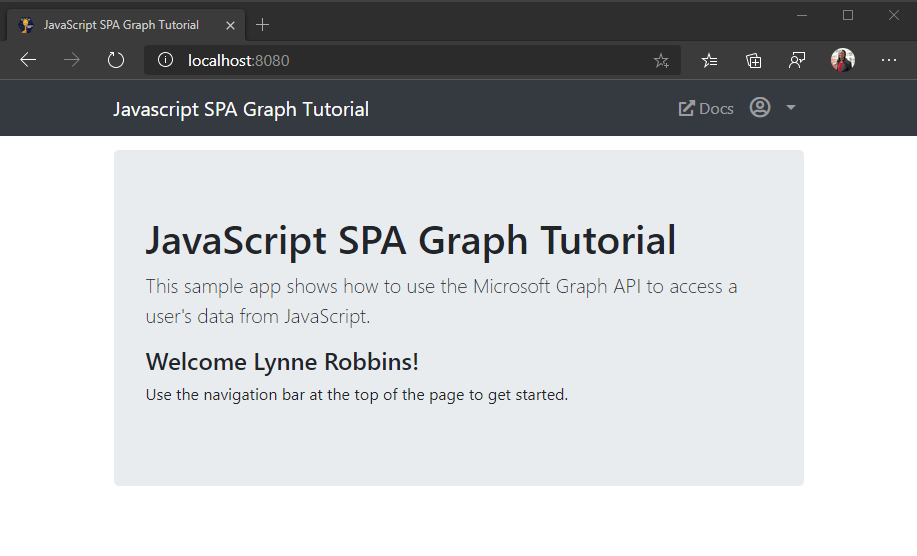

<!-- markdownlint-disable MD002 MD041 -->

Neste exercício, você estenderá o aplicativo do exercício anterior para oferecer suporte à autenticação com o Azure AD. Isso é necessário para obter o token de acesso OAuth necessário para chamar o Microsoft Graph. Nesta etapa, você integrará a biblioteca da [biblioteca de autenticação da Microsoft](https://github.com/AzureAD/microsoft-authentication-library-for-js) ao aplicativo.

1. Crie um novo arquivo no diretório raiz chamado **config.js** e adicione o código a seguir.

    :::code language="javascript" source="../demo/graph-tutorial/config.example.js" id="msalConfigSnippet":::

    Substitua `YOUR_APP_ID_HERE` pela ID do aplicativo do portal de registro do aplicativo.

    > [!IMPORTANT]
    > Se você estiver usando o controle de origem como o Git, agora seria uma boa hora para excluir o arquivo **config.js** do controle de origem para evitar vazar inadvertidamente sua ID de aplicativo.

1. Abra **auth.js** e adicione o seguinte código ao início do arquivo.

    :::code language="javascript" source="../demo/graph-tutorial/auth.js" id="authInitSnippet":::

## <a name="implement-sign-in"></a>Implementar logon

Nesta seção, você implementará as `signIn` `signOut` funções e.

1. Substitua a função `signIn` existente pelo seguinte.

    ```javascript
    async function signIn() {
      // Login
      try {
        // Use MSAL to login
        const authResult = await msalClient.loginPopup(msalRequest);
        console.log('id_token acquired at: ' + new Date().toString());
        // Save the account username, needed for token acquisition
        sessionStorage.setItem('msalAccount', authResult.account.username);
        // TEMPORARY
        updatePage(Views.error, {
          message: 'Login successful',
          debug: `Token: ${authResult.accessToken}`
        });
      } catch (error) {
        console.log(error);
        updatePage(Views.error, {
          message: 'Error logging in',
          debug: error
        });
      }
    }
    ```

    Este código temporário exibirá o token de acesso após um logon bem-sucedido.

1. Substitua a função `signOut` existente pelo seguinte.

    :::code language="javascript" source="../demo/graph-tutorial/auth.js" id="signOutSnippet":::

1. Salve suas alterações e atualize a página. Depois de entrar, você verá uma caixa de erro que mostra o token de acesso.

## <a name="get-the-users-profile"></a>Obter o perfil do usuário

Nesta seção, você melhorará a `signIn` função de usar o token de acesso para obter o perfil do usuário do Microsoft Graph.

1. Adicione a seguinte função no **auth.js** para recuperar o token de acesso do usuário.

    :::code language="javascript" source="../demo/graph-tutorial/auth.js" id="getTokenSnippet":::

1. Crie um novo arquivo na raiz do projeto chamado **graph.js** e adicione o código a seguir.

    :::code language="javascript" source="../demo/graph-tutorial/graph.js" id="graphInitSnippet":::

    Este código cria um provedor de autorização que envolve o `getToken` método em **auth.js** e inicializa o cliente de gráfico com esse provedor.

1. Adicione a seguinte função no **graph.js** para obter o perfil do usuário.

    :::code language="javascript" source="../demo/graph-tutorial/graph.js" id="getUserSnippet":::

1. Substitua a função `signIn` existente pelo seguinte.

    :::code language="javascript" source="../demo/graph-tutorial/auth.js" id="signInSnippet":::

1. Salve suas alterações e atualize a página. Depois de entrar, você deve terminar de volta na Home Page, mas a interface do usuário deve ser alterada para indicar que você está conectado.

    

1. Clique no avatar do usuário no canto superior direito para **acessar o link sair.** Clicar **em sair** redefine a sessão e retorna à Home Page.

    

## <a name="storing-and-refreshing-tokens"></a>Armazenar e atualizar tokens

Nesse ponto, seu aplicativo tem um token de acesso, que é enviado no `Authorization` cabeçalho das chamadas de API. Este é o token que permite que o aplicativo acesse o Microsoft Graph em nome do usuário.

No entanto, esse token é de vida curta. O token expira uma hora após sua emissão. É onde o token de atualização se torna útil. O token de atualização permite que o aplicativo solicite um novo token de acesso sem exigir que o usuário entre novamente.

Como o aplicativo está usando a biblioteca MSAL, você não precisa implementar qualquer lógica de armazenamento ou de atualização. O MSAL armazena em cache o token na sessão do navegador. O `acquireTokenSilent` método primeiro verifica o token em cache e, se ele não tiver expirado, ele o retornará. Se ele tiver expirado, ele usará o token de atualização em cache para obter um novo. O objeto de cliente Graph chama o `getToken` método em **auth.js** em todas as solicitações, garantindo que ele tenha um token atualizado.
