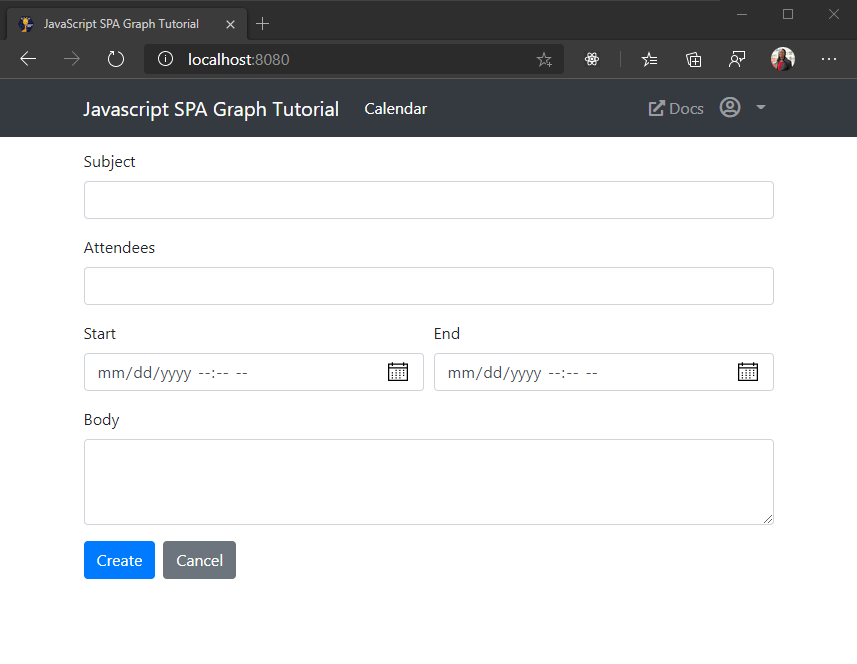

<!-- markdownlint-disable MD002 MD041 -->

Nesta seção, você adicionará a capacidade de criar eventos no calendário do usuário.

## Criar um novo formulário de eventos

1. Adicione a seguinte função a **ui.js** para renderizar um formulário para o novo evento.

    :::code language="javascript" source="../demo/graph-tutorial/ui.js" id="showNewEventFormSnippet":::

## Criar o evento

1. Adicione a seguinte função a **graph.js** para ler os valores do formulário e criar um novo evento.

    :::code language="javascript" source="../demo/graph-tutorial/graph.js" id="createEventSnippet":::

1. Salve suas alterações e atualize o aplicativo. Clique no item de navegação **calendário** e, em seguida, clique no botão **criar evento** . Preencha os valores e clique em **criar**. O aplicativo retorna para o modo de exibição calendário depois que o novo evento é criado.

    
